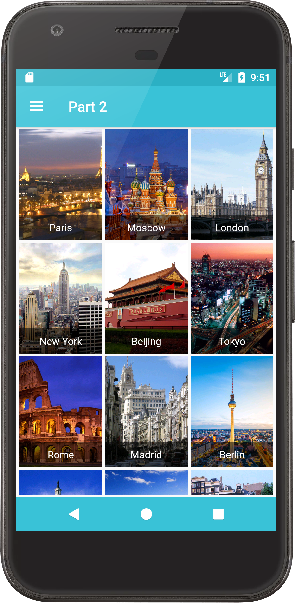

# City Map - Android application (Java)

В данном репозитории расположены различные материалы для пошагового создания с нуля простого мобильного приложения **City Map** для платформы **Android**, на языке программирования **Java**.

**City Map** - мобильное приложения для просмотра базовой информации о различных городах.

Основные функции:

* Постраничная навигация;
* Загрузка данных из сети;
* Оффлайн доступ к данным;
* Отображение городов на мировой карте.

 

### Для чего?

Если вас когда-либо интересовала нативная разработка для мобильных устройств на платформе **Android** и Вы хотели бы попробовать себя в этом, то вы можете попробовать начать изучение используя материалы из данного репозитория.

### Что нужно, чтобы начать?

Для того, чтобы начать изучать нативную мобильную разработку под **Android**, Вам понадобится:

* Среда разработки **Android Studio** (или Eclipse) и **SDK**;
* Базовые знания английского языка (для чтения материалов);
* Базовые навыки работы с Git;
* Базовые знания языка программирования Java.

### Установка и настройка

* [Установка Android Studio и SDK](https://developer.android.com/studio/index.html)

### Задания

Мы предлагаем Вам познакомиться с нативной разработкой под платформу **Android**, путем последовательного выполнения заданий по созданию приложения **CityMap**.

#### Часть 0

**Основные понятия**:
`Android Studio`, `SDK`, `AndroidManifest`, `Gradle Plugin`, base structure of android project.

**Задание**:
В рамках данного задания требуется создать новый проект с одним экраном и xml-файлом разметкой для него.

Результат, который должен получиться: [GitHub](https://github.com/it-shark-pro/mobile-citymap-android/tree/part0)

#### Часть 1

**Основные понятия**: 
`Application`, `Activity`, `Fragment`, `Intent`, `Resources`, `XML`, `View` and `ViewGroup`, base layouts (`LinearLayout`, `FrameLayout`, `RelativeLayout`), base views (`TextView`, `ImageView`), `RecyclerView` and `Adapter` for it, base `Listeners` for view.

**Задание**: 
Данное задание требует создать список элементов (не более 10) с открытием экрана с детальным описанием после нажатия на конкретным элемент списка. Каждый элемент списка это объект класса с некоторым набором атрибутов и методов. Объекты класса как и сам список создаются программно в рамках приложения. Базовый объект класса должен содержать такие поля как `id`, `name` и `description`.

**Дополнительно:** 
`ConstraintLayout` и `FlexBox`,  `ViewHolder pattern`, `ItemDecorator` for `RecyclerView`, `CustomView`

Результат, который должен получиться: [GitHub](https://github.com/it-shark-pro/mobile-citymap-android/tree/part1)

 

#### Часть 2

**Основные понятия**: `Threading`, `ThreadPool`, `AsyncTasks`, `Loaders`, `REST Api`, `Http Request`, `Json`, `Bitmap`, `Drawable`.

**Задание**: 
В рамках данного задания требуется провести модификацию приложения полученного в **Часть 1** - заменить заданные вручную данные на полученные из сети в формате `JSON`. Реализовать загрузку и отображение картинок как для каждого элемента списка, так и в рамках экрана с детальным описанием. Приложение должно проверять наличие интернет соединения и сообщать о его отсутствии при попытке сделать запрос в сеть для загрузки данных. Для отображения картинок можно использовать одну из данных библиотек - `Picasso`/`Glide`.

**JSON** - [https://api.myjson.com/bins/eug9h](https://api.myjson.com/bins/eug9h)

**Дополнительно**: `OkHttp`, `Retrofit`, `Gson`, `Jackson`, `RxJava`/`RxAndroid`, `VectorDrawable`

Результат, который должен получиться: [GitHub](https://github.com/it-shark-pro/mobile-citymap-android/tree/part2)

  

#### Часть 3

**Основные понятия**: `SharedPreferences`, `Files`, `SQLite`, `ORM databases`, `NoSQL databases`.

**Задание**: В рамках данного задания требуется организовать работу с базой данных. Полученные данные в рамках **Часть 2** должны сохраняться в БД, а после, в ситуации с отсутствие интернет-соединения/ошибкой при загрузке данных из сети, доставаться из нее и отображаться пользователю.

**Дополнительно**: `OrmLite`, `GreenDAO`, `Realm`, `ObjectBox`.

Результат, который должен получиться: [GitHub](https://github.com/it-shark-pro/mobile-citymap-android/tree/part3)

#### Часть 4
**Основные понятия**: `Base of material design`, `Support AppCompat libs`, `Google Play Services` и `Firebase services`
**Задание**: Преобразование приложения в рамках `Material design`, добавление в приложения `google map` и отображение на ней по полученным из `json` координатам изображений.

Результат, который должен получиться: [GitHub](https://github.com/it-shark-pro/mobile-citymap-android/tree/part4)

## Туториал

**Tip** - небольшие советы по разработке.

**WKM** - информация для углубленного изучения.

 

#### Часть 0 и Часть 1

1. Создадим новый проект со стартовым экраном `EmptyActivity`.

  **WKM**: [Основы создания приложений](https://developer.android.com/guide/components/fundamentals.html?hl=ru#body-content)

2. Для создания списка, будем использовать `RecyclerView`. Эта `View` не входит в стандартный пакет, так что добавим необходимую зависимость в `build.gradle` файл.

3. Добавим `RecyclerView` в макет окна - файл-ресурс `activity_main.xml`.

**WKM**: [Подробнее о ресурсах приложения](https://developer.android.com/guide/topics/resources/accessing-resources.html?hl=ru)

**Tip**: `Id` будем задавать в формате `<what_where_name>`

4. Создадим файл с внешним видом каждого элемента в `RecyclerView` - `adapter_list_item.xml`.

**Tip**: Для названия элементов списка в `RecyclerView` используется шаблон `adapter_<name>_item`.

5. Хорошим тоном считается выносить отступы (а так же цвета, и др. ресурсы) в отдельный файл. Поэтому вынесем стандартные отступы 16 (отступ для экрана), и 8 (для контента) в `dimen.xml`.

6. Добавим необходимые виджеты в файл adapter_list_item.xml.

**WKM**: [Подробнее о макетах](https://developer.android.com/guide/topics/ui/declaring-layout.html)

7. Элементы списка должны выводить имя и описание, а также иметь номер для их идентификации. Для удобства работы создадим класс-модель `ListItemModel`. Пропишем необходимые поля класса и гет-методы. В рамках этого задания все айтемы имеют одинаковые шаблоны для названия `"Item <id>"` и описание `"This is item <id>"`. Вынесем эти строки-шаблоны в приватные поля класса, и используем в конструкторе для инициализации полей `name`, `description`.
  
**Tip**: Воспользуйтесь возможностями среды AndroidStudio. ПКМ -> Generate, и дальше сгенерируйте гет-методы.

8. Для работы `RecyclerView` необходимы так же 2 сущности - `Adapter`, который будет контролировать создание и инициализацию внешнего вида каждого элемента в списке. И `LayoutManager` - отвечает за компоновку элементов (списком, сеткой и т.п.). Сделаем свою реализацию адаптера, для начала создав пустой класс `ListAdapter`.

**WKM**: [Подробнее о `RecyclerView`](https://developer.android.com/training/material/lists-cards.html?hl=ru)

9. Создадим внутренний класс `ViewHolder`, отнаследовав его от `RecyclerView.ViewHolder`. Этот класс нужен для реализации адаптера и будет содержать ссылки на вью элемента списка.

10. Пропишем родителя для нашего адаптера - стандартную реализации - `RecyclerView.Adapter`, в качестве параметра класса, укажем созданный на предыдущем шаге `ViewHolder`.

11. Создадим объект-список моделей элементов(`List<ListItemModel> items`).

12. После этого, среда попросит нас перегрузить 3 метода:
- `onCreateViewHolder` - метод который вызовется при создании элемента в списке. В нем мы предоставляем визуальным представлением элемента (файл `adapter_list_item.xml`) объекту класса `ViewHolder`.
- `onBindViewHolder` - вызывается при отрисовке каждого элемента на экране. Нужен для того что бы инициализировать вью элемента данными из модели.
- `getItemCount` - метод возвращающий количество элементов списка.

13. Что бы удобно обновить содержимое списка, создадим метод update. В нем обновляем модель списка (`item`), и уведомляем систему о том что содержимое списка было обновлено и необходимо перерисовать содержимое `RecyclerView`. За последнее отвечает вызов `notifyDataSetChanged`.

**WKM**: [Подробнее о методах обновления списка и самом списке](https://developer.android.com/reference/android/support/v7/widget/RecyclerView.Adapter.html).

14. Теперь у нас есть все необходимое для показа списка элементов. Создаем метод `initList`. Для работы `RecyclerView` создадим менеджер лэйаута - `LinearLayoutManager` с вертикальной ориентацией. И объект адаптера `ListAdapter`.

**WKM**: [Подробнее о `LinearLayoutManager`](https://developer.android.com/reference/android/support/v7/widget/RecyclerView.LayoutManager.html).

15. Теперь необходимо передать адаптеру данные элементов списка для отображения. Воспользуемся созданным ранее методом `update`. На вход дадим результат работы метода `initListItemModels`.

16. Добавим декоратор для элементов списка. Воспользуемся стандартной реализацией - классом `DividerItemDecoration`. Декоратор будет добавлять разделяющию линию между элементами списка.

**WKM**: [Подробнее о `DividerItemDecoration`](https://developer.android.com/reference/android/support/v7/widget/RecyclerView.ItemDecoration.html).

17. Согласно заданию, по нажатию на элемент списка у нас должно открываться активити с детальной информацией. `RecyclerView` не предоставляет удобный способ понять на какой элемент списка нажали. Нам необходимо реализовать эту функциональность самостоятельно. Реализуем слушатель нажатия `View.OnClickListener` в классе `ViewHolder` и перегрузим метод `onClick`.

Мы могли бы попытать запускать открытие следующего экрана уже здесь, но это нарушило бы абстракцию. Адаптер не должен ничего знать о других экранах приложения, и тем более брать на себя работу `Activity`. Мы получим возможность использовать этот адаптер при необходимости и в других местах, когда по клику должно быть совершено другое действие.

Мы можем передавать адаптеру ссылку на активити, и в методе `onClick` `ViewHolder`'а вызывать у активити метод стартующий другой экран. Решение уже лучше, но нужно помнить о сокрытии данных. Получая ссылку на активити, в адаптере нам становятся доступны все ее методы.

Решением будет использовать новый тип, под видом которого мы будем передавать ссылку на аквити в адаптер. Создадим интерфейс `ItemClickListener`, с одним методом - `onItemClick`. И реализуем этот интерфейс в классе `MainActivity`.

18. В теле метода `onItemClick` необходимо будет стартовать `DetailedActivity`, но поскольку его сейчас нет, для проверки создадим всплывающее сообщение - Toast.
**WKM**: [Подробнее о Toast](https://developer.android.com/guide/topics/ui/notifiers/toasts.html)

19. В адаптере создадим методы `setItemClickListener`, `getItemByPosition`.

20. В методе `onClick` `ViewHolder`'а, вызовем `onItemClick`.

21. Возвращаемся в `MainActivity` и вызываем метод `setItemClickListener` у адаптера, передав `this` - ссылку на активити.

22. Создаем новую активити `DetailedActivity`, при этом не забывая упомянуть о новом экране в манифест файле.

23. Создадим разметку экрана в файле `activity_detailed.xml`.

24. Вынесем размеры и начертания текста в отдельные стили, в файл `styles.xml`

25. Вернемся в метод `onItemClick`, который выполнится по нажатию на элемент списка. Создадим `Intent` стартующий `DetailedActivity`. А так же с помощью `Intent`'а мы передадим в другой экран данные элемента - `name` и `description`.
**WKM**: [Подробнее об Intent](https://developer.android.com/reference/android/content/Intent.html).

26. Перейдем в `DetailedActivity`. В методе `onCreate` получаем доп. данные, которые содержал `Intent`, извлекая их по присвоенным именным константам. И инициализируем этими данными вьшки (`nameTextView`, `descriptionTextView`).

27. Заверщаюшим шагом будет добавление кнопки "Назад" в тулбаре у `DetailedActivity`. Сначала в методе `onCreate` отобразим ее. А дальше - навесим логику закрытия активити, переопределив метод `onSupportNavigateUp`.

#### Часть 2

1. Для удобной работы с сервером, используем библиотеку `GSON` для парсинга `json`'а и `OkHTTP` для отправки и получения запроса. Добавим необходимые зависимости в build.gradle. И сразу добавим в манифест файл пермишен на доступ к интернету.

**WKM**: [Permissions](https://developer.android.com/guide/topics/permissions/requesting.html)

**WKM**: [GSON](https://github.com/google/gson)

**WKM**: [OkHTTP](http://square.github.io/okhttp/)

2. Воспользуемся классом `AsyncTask` для асинхронной работы с сервером. Создадим его наследника - класс `LoadCitiesTask` с параметрами класса - `<Void, Void, List<ListItemModel>>`

**WKM**: [AsyncTask](https://developer.android.com/reference/android/os/AsyncTask.html)

3. Инициализируем объекты, в билдере реквеста укажем `URL` c которого будем получать данные городов. 

4. В теле метода `doInBackground`, который будет выполняться в отдельном потоке, создадим и выполним запрос к серверу. Далее узнаем успешно ли завершился наш запрос. Если да - то объект `response` будет содержать данные, извлечем их и приведем к строке. 

5. Полученная строка - это `JSON`, содержащий данные городов. Если бы мы не использовали библиотеку `GSON`, нам бы пришлось извлекать город из общего списка, а затем получать каждое свойство в отдельности. И заносить в модель города. `GSON`'у достаточно показать класс модели, и если он составлен правильно - преобразовать `JSON` в объект этого класса. Потребуется 2 класса - `ListItemModelsResponse`, общий класс ответа, который содержит список из `ListItemModel` (городов). Достаточно что бы имена в классе модели и `JSON`'е совпадали.

**Tip**: Если вам необходимо что бы названия полей отличались, при этом сохранить возможность преобразование объекта в `JSON` и обратно - воспользуйтесь аннотацией `@SerializedName`.

6. Модель готова и можно десереализовать данные используя метод `gson.fromJSON()`. В параметрах передадим ссылку на класс, в который преобразовываем строку-JSON и саму строку.

7. После того как мы получили список городов необходимо передать его назад в `MainActivity`. Используем механизм обратного вызова, так же как мы поступили с передачей данных о кликнутом городе из адаптера. Создадим интерфес `IMainActivityView` с методом `showCities` и заимплементим его в `MainActivity`. Пока не будем отображать данные городов на экран, а выведем их на консоль для проверки. В конструкторе `LoadCitiesTask` получим объект `IMainActivity` и сохраним его в полях класса. В методе `onPostExecute`, который выполнится один раз, после того как doInBackground будет успешно завершен, вызовем у объекта `IMainActivity` метод `showCities`.

8. Осталось только оптимизировать и почистить класс `MainActivity` - в связи с тем, что список-айтемов превратился списком городов, информация о которых не создается в приложении, а получается с сервера.

9. Для отображения картинок воспользуемся библиотекой `Glide`. Она упрощает работу с изображениями, и предоставляет ряд полезных возможностей, например, кэширование. Добавим зависимость в `build.gradle`. 

**WKM**: [GLide](https://github.com/bumptech/glide)

10. Будем выводить картинки сеткой, для этого изменим `LayoutManager` на `GridLayoutManager`. Вместо вывода на консоль в `showCities`, обновим данные у адаптера. 

11. Элемент списка теперь должен отображать картинку города - перейдем в `adapter_city_item` и изменим макет. `TextView` с описанием нам уже не понадобится, а вот для отображения картинки города необходим виджет `ImageView` (а еще лучше - его версия из `support` пакета). Что бы картинки хорошо смотрелись на любых экранах - будем использовать не фиксированные значения высоты и ширины, а зададим их через пропорции. В этом нам поможет `ConstraintLayout`, для виджетов находящихся в этом контейнере можно указать параметр соотношения `layout_constraintDimensionRatio`.

**WKM**: [Support Library](https://developer.android.com/topic/libraries/support-library/index.html)

**WKM**: [ConstraintLayout](https://developer.android.com/reference/android/support/constraint/ConstraintLayout.html) 

12. Перейдем в сам адаптер. В методе по отрисовке айтема - `onBindViewHolder`, вызовем `Glide.with`, передавая методу контекст приложения, задаем урл изображения, и `ImageView` для отображения.

13. Теперь изменим макет экрана с деталями - `activity_city_details` - необходимо добавить виджет для вывода изображения. И немного отрефакторить файл, удалив ненужный `FrameLayout`. 
**Note**: Изначально я так же пробовал изменить макет через `ConstraintLayout`, но решил не усложнять. Вот только не убрал и закомитил лишние атрибуты app:... и `GuideLine`) Прошу не обращать на них внимание, в случае отстутствия `ConstraintLayout`, они попросту игнорируются.

14. В `Intent` на старт `CityDetailedActivity`, теперь передадим еще один доп. параметр - `url` изображения. Аналогично адаптеру, настроим глайд на загрузку изображения в `CityDetailedActivity`.

**WKM**: После того как изображение загрузилось на главном экране, оно поместиться в кэш. Это полезно, потому что глайду не потребуется грузить картинку второй раз: для отображения он просто достанет старую версию из кэша.

15. Осталось только выводить сообщение при отсутствии интернета. Для этого добавим в `AndroidManifest` запрос на разрешение - `ACCESS_NETWORK_STATE`. И воспользуемся службой `CONNECTIVITY_SERVICE` для определения состояния интернета, в методе `isNetworkAvailable`.

#### Часть 3

1. Для построения офлайн хранилища воспользуемся файлами настроек - `SharedPreferences`. Создадим класс `Database`, в конструктор передадим контекст приложения. Файлу настроек необходим уникальный идентификатор - создадим константу `CITIES_DB_NAME`.  

**WKM**: [SharedPreferences](https://developer.android.com/training/basics/data-storage/shared-preferences.html?hl=ru)

2. Файлы настроек хранят информацию в формате Ключ-Значение, для сохранения `JSON` строки с данными полученными от сервера, создадим ключ `CITIES_RESPONSE_KEY` - создадим его как поле класса.

3. В методе `saveCitiesResponse` получим объект для редактирования файла - `SharedPreferences.Editor`, вызовом метода `edit`. Под созданным ранее ключом занесем строку c ответом. И сохраним изменения вызвав метод `apply`.

4. Создадим метод `loadCitiesResponse`, в котором достанем строку по ключу.

5. Настало время позаботиться о внутренней архитектуре и прийти к чему я уже давно шел - паттерну `MVP`. Слой отвечающий за данные у нас уже есть, а вот `View` и `Presenter` пока содержались в одном классе `Activity`. 

Создадим отдельный класс `MainPresenter` и вынесем в него всю логику работы с данными. А именно:
- парсинг данных в метод `parseCitiesResponse`. 
- проверка статуса интернет соединения в метод `isNetworkAvailable`.
- метод `loadCities`, в котором в зависимости от наличия интернета данные будут браться либо из сети, либо из локального хранилища. Он будет вызываться из `MainActivity`.

Данные из БД, или с сервера теперь должны проходить через `Presenter`. Слой `View` служит лишь для отображения. 

6. Создадим интерфейс `IDataSubscriber`, который будет реализовывать `MainPresenter`. `onDataLoaded` будет вызываться в случае если данные были успешно получены, сохранять респонс в БД, парсить и передавать в `MainAcitivity`. В случае ошибки - `onLoadError`, вызывающий у `MainActivity` метод `showServerRequestFailed`.

7. Передадим в конструкторе для `LoadCitiesReponseTask` ссылку на `MainPresenter` как тип `IDataLoader`.

#### Часть 4

1. Студия предоставляет удобный темплейт для создания экрана с картами. Благодаря этому почти все задание можно свести к командам: ПКМ (на папке в окне структуры проекта) -> New -> Google -> Google Maps Activity. Дальше для использования карты необходимо будет получить `API KEY`. Следуйте инструкциям из файла `google_maps_api`.

**Tip**: [Или воспользуйтесь этим, более длинным руководством](https://developers.google.com/maps/documentation/android-api/start#get-key)

2. У `MapActivity` есть метод `onMapReady`, который вызовется когда карта будет готова. В цикле, приходясь по списку городов, создадим маркеры (красные указатели), и добавим их на карту. Указателю необходимо передать координаты, с помощью объекта `LatLng`, и имя.

3. Осталось создать кнопку по которой будет происходить старт `MapActivity`. Сделаем ее с помощью меню опций. Создадим `main_menu.xml` в каталоге `res\menu`, и добавим один айтем с названием и id.

4. Переопределим метод `onCreateOptionsMenu` и добавим свое меню - `main_menu.xml`. 

5. Обработаем нажатие на айтем меню в методе `onOptionsItemSelected` - с помощью объекта `Intent` стартанем `MapActivity`. И передадим в дополнительных параметрах список городов.
